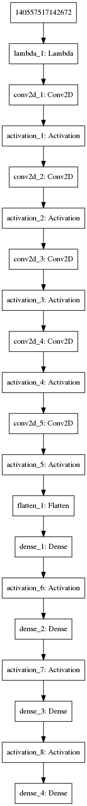
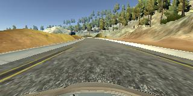
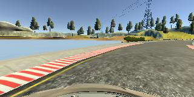
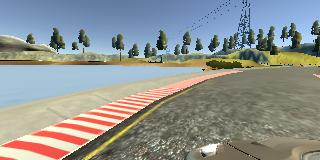
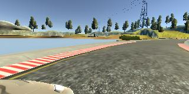
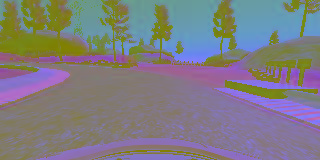
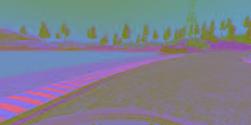
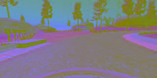
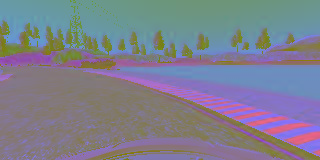

# **Behavioral Cloning** 

## Writeup Template

### You can use this file as a template for your writeup if you want to submit it as a markdown file, but feel free to use some other method and submit a pdf if you prefer.

---

**Behavioral Cloning Project**

The goals / steps of this project are the following:
* Use the simulator to collect data of good driving behavior
* Build, a convolution neural network in Keras that predicts steering angles from images
* Train and validate the model with a training and validation set
* Test that the model successfully drives around track one without leaving the road
* Summarize the results with a written report


[//]: # (Image References)

[image1]: ./examples/model.png "Model Visualization"
[image2]: ./examples/yuv_image.png "YUV image"
[image3]: ./examples/driving_side1.jpg "Recovery Image"
[image4]: ./examples/driving_side2.jpg "Recovery Image"
[image5]: ./examples/driving_side3.jpg "Recovery Image"
[image6]: ./examples/yuv_image2.png "Normal Image"
[image7]: ./examples/flipped_image2.png "Flipped Image"

## Rubric Points
### Here I will consider the [rubric points](https://review.udacity.com/#!/rubrics/432/view) individually and describe how I addressed each point in my implementation.  

---
### Files Submitted & Code Quality

#### 1. Submission includes all required files and can be used to run the simulator in autonomous mode

The most important files of my project includes the following:
* `model_v1.py` containing the script with the CNN architecture and the first version of the generator. Additionally, the network is trained on this script
* `model.py` containing the final version of the generator (this is because final model followed an iterative approach)
* `drive.py` for driving the car in autonomous mode
* `model.h5` containing the final version of the trained convolution neural network 
* `writeup.md` summarizing the results

#### 2. Submission includes functional code
The simulator provided in the Udacity Platform did not work good for me. Instead I used the simulator referenced by [this udacity helpful guide](https://s3-us-west-1.amazonaws.com/udacity-selfdrivingcar/Behavioral+Cloning+Cheatsheet+-+CarND.pdf) and my drive.py file, the car can be driven autonomously around the track by executing 
```sh
python drive.py model.h5
```

#### 3. Submission code is usable and readable

The `model_v1.py` file contains the code for training and saving the first version of the convolution neural network. The final model was obtained by following an iterative approach where based on the first trained model and validating the performance on the simulator in autonomous mode, the next models were trained by doing a kind of transfer learning, in which I took the results from last trained model as the starting point, I collected new training data with the simulator and finally I continued the training on the neural network with the new data. The `model_v1.py`  file shows the pipeline I used for training the model, and it contains comments to explain how the code works, especially the generator function. The `model.py` file is the final version of the approach taken. Basically the only thing that changes is the generator function in which other data augmentation techniques are taken into account like images from the three cameras and a process that flips each of those images horizontally

### Model Architecture and Training Strategy

#### 1. An appropriate model architecture has been employed

I used the approach encouraged by Udacity with [this powerful CNN from Nvidia](https://devblogs.nvidia.com/deep-learning-self-driving-cars/).  the model architecture is presented in the table below: 

| Layer         		|     Description	        					| 
|:---------------------:|:---------------------------------------------:| 
| Input         		| 66x200x3 YUV image   							| 
|Normalization layer    |                               |
| Convolution 5x5     	| 2x2 stride, valid padding, outputs 31x98x24 	|
| RELU					|												|
| Convolution 5x5      	| 2x2 stride,  valid padding, outputs 14x47x36  				|
| RELU                  |                           |
| Convolution 5x5	    | 2x2 stride, valid padding, outputs 5x22x48	|
| RELU					|												|
| Convolution 3x3	   	| 1x1 stride, valid padding, outputs 3x20x64    				|
| RELU                  |                         |
| Convolution 3x3       | 1x1 stride, valid padding, outputs 1x18x64 |
| RELU                  |                         |
| Fully connected		| outputs 100  									|
| RELU					|		 				|
| Fully connected       | outputs 50             |
| RELU                  |                        |
| Fully connected 		| outputs 10   			|
| RELU                  |                       |
| Fully connected		| outputs 1  									

The model is implemented in python file `model_v1.py` in lines 64-84. After each convolution and fully connected layer there is a RELU layer to introduce nonlinearity. Data is normalized using a keras lambda layer, which is reflected in line 66

#### 2. Attempts to reduce overfitting in the model

The reduce overfitting, I use data augmentation techniques in three ways:
- *Collecting more data with the simulator in training mode*: I followed an iterative approach to get the final model. Each time I trained a model, that model was evaluated in the simulator in autonomous mode. I detected the conditions under which the model failed and tried to collect new data from the simulator in training mode that would be useful for training the model further in a next iteration. That is the reason why in the workspace there are some additional python files like `model_v2.py, model_v3.py, ...`. 

- *Collecting images from the left and right cameras*: To get more data, and avoid the car from going off the road, I use the data from the left and right cameras and compute the angle using a correction factor of `0.2`.

- *Generating new synthetic data*: Finally, I collected new data by augmenting each of the left, center and right camera images. Specifically, I flipped each image horizontally which can be seen in line 36 on `model.py`

The model was trained and validated on different data sets to ensure that the model was not overfitting. This is explained by the iterative approach I took, in which if the model failed in some conditions I collected new data to learn new patterns. Also I drive the track in backwards mode to make the model generalize better. The last approach that improved the model was to get data from a joystick instead of the keyboard which takes better measures in the steering angle. The model was tested by running it through the simulator and ensuring that the vehicle could stay on the track.

#### 3. Model parameter tuning

The model used an adam optimizer, so the learning rate was not tuned manually (`model_v1.py` line 86).

#### 4. Appropriate training data

Training data was chosen to keep the vehicle driving on the road. I used a combination of center lane driving, recovering from the left and right sides of the road. I also drove the car in the opposite direction to make a  better training set and to get the final model I decided to record data with a joystick instead of the keyboard which improved a lot the model

For details about how I created the training data, see the next section. 

### Model Architecture and Training Strategy

#### 1. Solution Design Approach

My first step was to use [this powerful CNN from Nvidia](https://devblogs.nvidia.com/deep-learning-self-driving-cars/)  which was suggested in the course. I thought this model might be appropriate because the neural network architecture was designed specifically for self driving cars.

I used the data provided in the project workspace to get the first model and in order to gauge how well the model was working, I split my image and steering angle data into a training (80%) and validation set (20%). The code for this version is in the file `model_v1.py`. The strategy there was to take into account only the images from the center camera ( lines 51-52 in `model_v1.py` ).  I found that my first model was not generalizing better when run in the simulator in autonomous mode, which indicates overfitting. 

To combat overfitting, I modified the strategy to get more data, this time driving from side to side so that the car could learn to recover back to center. The other improvement was to have into account images from left and right cameras (lines 50-51 in file `model_v2.py`). For the training process I decided to load the previous model (the model `model_v1.h5` generated by `model_v1.py`) and continue the training with the new data based on that pre-trained model (line 69 in file `model_v2.py`) and that way train the CNN faster. I found that the model was better, but the car in some cases get off the road

Then, following the same approach as before, I collected new data. This time I also improved the generator a little more by generating new synthetic data in this way: I took the images from center, left and right cameras and I created new data by flipping horizontally (line 36 on python file `model_v3.py` ). This gave me as a result the mode `model_v3.h5`.

I continued iterating and getting new data for training following this approach, and as a result, I end up with model `model_v4.h5, model_v5.h5 and model_v6.h5`. At the end the model was not good enough to drive the complete track in autonomous mode.

The final improvement was to use joystick instead of keyboard. In this case as the joystick could output different angles than the keyboard, so I collected a bigger training set in the simulator (roughly 2.3 GB) driving along the center, recovering from sides and driving in the opposite direction. I loaded the model `model_v6.h5` as a starting point and continue the training process with this new data and I could get the results I expected.

At the end of the process, the vehicle is able to drive autonomously around the track without leaving the road.

#### 2. Final Model Architecture

The neural network architecture did not change across iterations but the process to get new data changed. The final approach has the following items:
- Using generator to process the whole training set in mini batches 
- Randomly shuffle the data
- Using joystick instead of keyboard
- Using the images from center, left and right cameras
- Data augmentation by flipping horizontally
- Driving in the opposite direction to make the model generalize better

Here is a visualization of the architecture



#### 3. Creation of the Training Set & Training Process

To capture good driving behavior in the final model using a joystick, I first recorded three laps on track one using center lane driving. Here is an example image of center lane driving:



I then recorded the vehicle recovering from the left side and right sides of the road back to center so that the vehicle would learn to stay on track. These images show what a recovery looks like:





The proposed architecture also requires the images in YUV color space. Here there are two images converted from RGB to YUV:




To augment the dataset, I also flipped images and angles thinking that this would be helpful. For example, here the two images above have been flipped horizontally:





After the collection process with the joystick, I had `164544` number images. I then preprocessed this data by resizing (with the generator) to `66 x 200 px`  and then I flipped each image horizontally. I end up with `329088` data points to generate the last model.

I finally randomly shuffled the data set and put 20% of the data into a validation set. 

I used this training data for training the model. The validation set helped determine if the model was over or under fitting. The ideal number of epochs was 5 since after that epoch the validation and training loss don't improve too much. I used an adam optimizer so that manually training the learning rate wasn't necessary.
